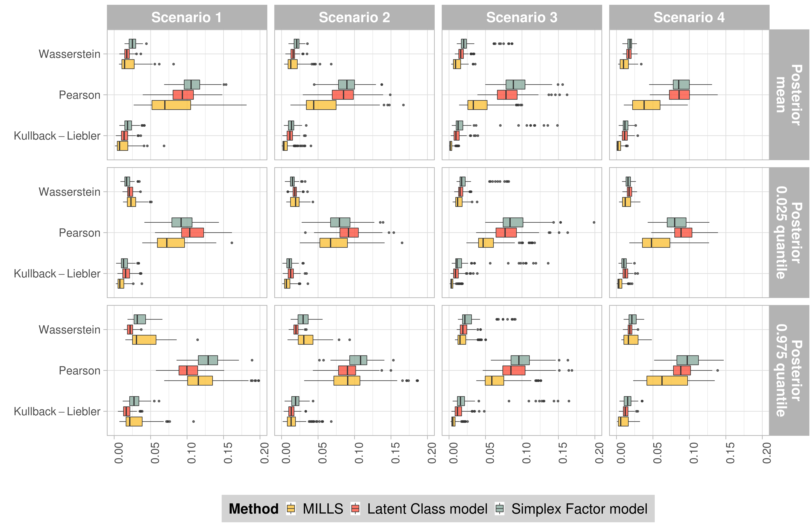

# Simulation studies
This file illustrates how to reproduce results from [Aliverti, E. and Dunson, D. (2020) Composite mixture of log-linear models for categorical data](arxiv.org/), Section 3.

## Set-up
We recommend to install the package locally, for example in a `./lib` folder.
Starting from the location of the repository (e.g. `~/GIT/mills/`)
```bash
# create if does not exist
mkdir lib/

# compile attributes
R -q -e "setwd('mills'); Rcpp::compileAttributes(verbose=T)"

# fast build and install 
R CMD build --no-build-vignettes --no-manual mills
R CMD INSTALL --no-docs --no-html -l lib mills
```

## Run simulations

Each folder contains different ordered scripts, supposed to be executed in order.

### Mills

```bash
01_MILLS/
├── 01_scen1.R
├── 02_scen2.R
├── 03_scen3.R
├── 04_scen4.R
└── 05_compute_biv.R
```

Each script `0%s_scen%s.R` simulates the data under scenario `%s`, save them as a `.txt` file and performs posterior sampling.
It can be executed, for example, using `Rscript 01_scen1.R`.
Posterior samples are saved in a separate `Scen%s.RData` files. Each simulation takes roughly $15$ minutes on a standard laptop, so the global time required is around $60$ minutes.
Lastly, `05_ComputeBiv.R` computes the posterior distribution of the estimated bivariate distributions, and summarise them via posterior mean and posterior $0.025$ and $0.975$ quantiles.
A one-line-command to run all the scripts (starting from `cd 01_MILLS/`) and compute the functional of interest is

```bash
for f in $(ls *.R); do Rscript $f; done
```

### Competitors

```bash
02_COMPETITORS/
├── LATENT_CLASS
│   ├── 01_LatentClass.R
│   ├── 02_ComputeBiv.R
│   └── LantentClass.stan
└── SIMPLEX_FACTOR
    ├── 01_SimplexFactor.R
    ├── 02_ComputeBiv.R
    └── SimplexFactor.stan
```

As a competitor approaches we have considered two popular latent structure models.
The methods are implemented in `stan` and, therefore, a working installation of the package [`rstan`](https://github.com/stan-dev/rstan/) is required. 
Simulated data are created with the scripts `01_MILLS/0%s_scen%s.R`.
Posterior simulation requires roughly $78$ minutes for the Simplex Factor model and $55$ minutes for the Latent Class model. Posterior samples are saved in separate `RData` files, while `02_ComputeBiv.R` computes the posterior distribution of the estimated bivariate distributions, and summarise them via posterior mean and posterior $0.025$ and $0.975$ quantiles.
Starting from `cd 02_COMPETITORS`, the scripts can be executed as

```bash
cd LATENT_CLASS
for f in $(ls *.R); do Rscript $f;done
cd ../
```
and 
```bash
cd  SIMPLEX_FACTOR/
for f in $(ls *.R); do Rscript $f;done
cd ../
```


### Plot results

```bash
03_POST_PROCESS/
├── PlotResults.R
└── simulation_complete.png
```
Results are displayed graphically, comparing the goodness of fit of the proposed approaches in terms of Wasserstein Distance, normalised Pearson's residuals and Kullback-Liebler divergence.
The script `PlotResults.R` can be executed as `Rscprit PlotResults.R`; it requires the `*_biv.RData` output for all the settings described above, and generates the following plot (Figure 2 of the paper).


